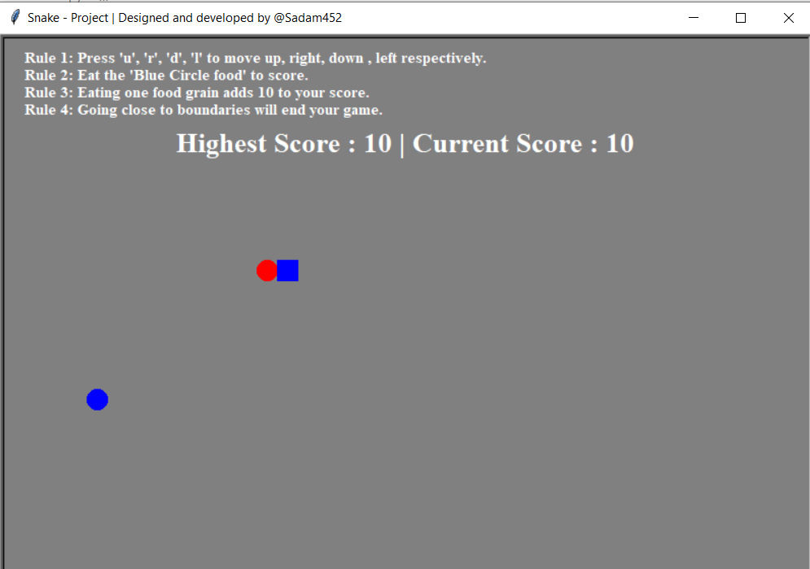

# snake Game
**In this game, a user can have 4 operations**:
_____
```
1. Move snake right by pressing "r" button.
2. Move snake down by pressing "d" button.
3. Move snake left by pressing "l" button.
4. Move snake up by pressing "u" button.

*User can score 10 by eating food (Blue circle).
*Game is over if snake touchs any boundary
**Game displays current and highest score
```
_____
## References::
```
Geeks for Geeks
```
## Output:
_____

